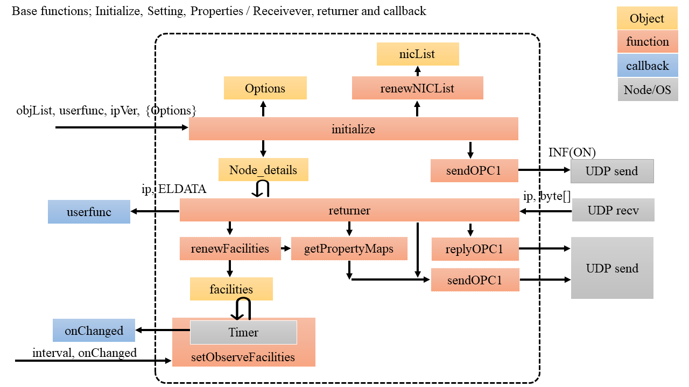
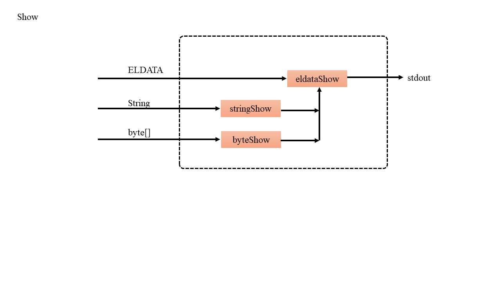
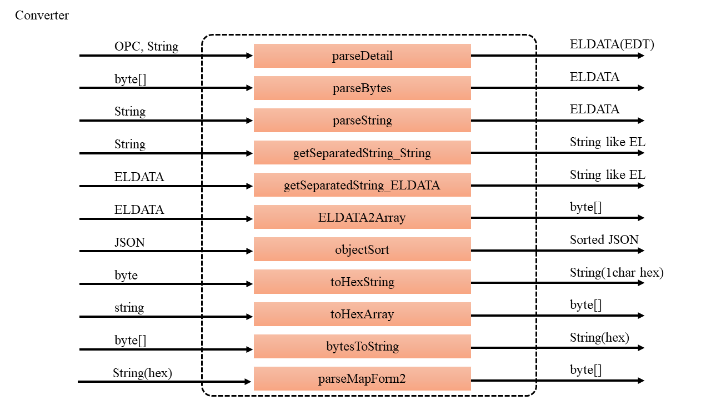

# Overview

このモジュールは**ECHONET Liteプロトコル**をサポートします．
ECHONET Liteプロトコルはスマートハウス機器の通信プロトコルです．

This module provides **ECHONET Lite protocol**.
The ECHONET Lite protocol is a communication protocol for smart home devices.


# Install

下記コマンドでモジュールをインストールできます．

You can install the module as following command.


```bash
npm i echonet-lite
```


# Demos

## Controller demo

デモプログラムはこんな感じです。動作させるためにはECHONET Lite対応デバイスが必要です。もしお持ちでない場合には**[MoekadenRoom](https://github.com/SonyCSL/MoekadenRoom)**というシミュレータがおすすめです。


Here is a demonstration script.
For test exectuion, some devices with ECHONET Lite is required.
If you do not have any device, we recommend the **[MoekadenRoom](https://github.com/SonyCSL/MoekadenRoom)** as a simulator.

```JavaScript:Demo
// モジュールの機能をELとして使う
// import functions as EL object
var EL = require('echonet-lite');

// 自分自身のオブジェクトを決める
// set EOJ for this script
// initializeで設定される，必ず何か設定しないといけない，今回はコントローラ
// this EOJ list is required. '05ff01' is a controller.
var objList = ['05ff01'];

////////////////////////////////////////////////////////////////////////////
// 初期化するとともに，受信動作をコールバックで登録する
// initialize and setting callback. the callback is called by reseived packet.
var elsocket = EL.initialize( objList, function( rinfo, els, err ) {

	if( err ){
		console.dir(err);
	}else{
		console.log('==============================');
		console.log('Get ECHONET Lite data');
		console.log('rinfo is ');
		console.dir(rinfo);

		// elsはELDATA構造になっているので使いやすいかも
		// els is ELDATA stracture.
		console.log('----');
		console.log('els is ');
		console.dir(els);

		// ELDATAをArrayにする事で使いやすい人もいるかも
		// convert ELDATA into byte array.
		console.log('----');
		console.log( 'ECHONET Lite data array is ' );
		console.log( EL.ELDATA2Array( els ) );

		// 受信データをもとに，実は内部的にfacilitiesの中で管理している
		// this module manages facilities by receved packets.
		console.log('----');
		console.log( 'Found facilities are ' );
		console.dir( EL.facilities );
	}
});

// NetworkのELをすべてsearchしてみよう．
// search ECHONET nodes in local network
EL.search();
```


## Device demo

こんな感じで作ってみたらどうでしょうか．
あとはairconObjのプロパティをグローバル変数として，別の関数から書き換えてもいいですよね．
これでGetに対応できるようになります．

This is a demo program for developping air conditioner object.


```JavaScript:Demo
//////////////////////////////////////////////////////////////////////
// ECHONET Lite
var EL = require('echonet-lite');

// エアコンを例に
// aircon object code is 0130, instance number is 01
var objList = ['013001'];

// 自分のエアコンのデータ，今回はこのデータをグローバル的に使用する方法で紹介する．
// define and management of my aircon data.
var airconObj = {
    // super
    "80": [0x30],  // 動作状態, power
    "81": [0xff],  // 設置場所, setting position
    "82": [0x00, 0x00, 0x66, 0x00], // EL version, 1.1
    "88": [0x42],  // 異常状態, error status
    "8a": [0x00, 0x00, 0x77], // maker code
    "9d": [0x04, 0x80, 0x8f, 0xa0, 0xb0],        // inf map, 1 Byte目は個数
    "9e": [0x04, 0x80, 0x8f, 0xa0, 0xb0],        // set map, 1 Byte目は個数
    "9f": [0x0d, 0x80, 0x81, 0x82, 0x88, 0x8a, 0x8f, 0x9d, 0x9e, 0x9f, 0xa0, 0xb0, 0xb3, 0xbb], // get map, 1 Byte目は個数
    // child
    "8f": [0x41], // 節電動作設定, mode of power saving operation
    "a0": [0x31], // 風量設定, Air volume setting
    "b0": [0x41], // 運転モード設定, running mode
    "b3": [0x19], // 温度設定値, temperature setting
    "bb": [0x1a] // 室内温度計測値, indoor temperature measurement
};

// ノードプロファイルに関しては内部処理するので，ユーザーはエアコンに関する受信処理だけを記述する．
// the module processes node profile automatically, programmer should describe process for air conditioner
var elsocket = EL.initialize( objList, function( rinfo, els ) {
    // コントローラがGetしてくるので，対応してあげる
    // エアコンを指定してきたかチェック
    if( els.DEOJ == '013000' || els.DEOJ == '013001' ) {  // the data is for aircon?
        // ESVで振り分け，主に0x60系列に対応すればいい
        switch( els.ESV ) {
            ////////////////////////////////////////////////////////////////////////////////////
            // 0x6x
          case EL.SETI: // "60
            break;
          case EL.SETC: // "61"，返信必要あり; responce required.
            break;

          case EL.GET: // 0x62，Get
            for( var epc in els.DETAILs ) {
                if( airconObj[epc] ) { // 持ってるEPCのとき;
                    EL.sendOPC1( rinfo.address, [0x01, 0x30, 0x01], EL.toHexArray(els.SEOJ), 0x72, EL.toHexArray(epc), airconObj[epc] );
                } else { // 持っていないEPCのとき, SNA; my air conditioner do not have the property.
                    EL.sendOPC1( rinfo.address, [0x01, 0x30, 0x01], EL.toHexArray(els.SEOJ), 0x52, EL.toHexArray(epc), [0x00] );
                }
            }
            break;

          case EL.INFREQ: // 0x63
            break;

          case EL.SETGET: // "6e"
            break;

          default:
            // console.log( "???" );
            // console.dir( els );
            break;
        }
    }
});

//////////////////////////////////////////////////////////////////////
// 全て立ち上がったのでINFでエアコンONの宣言
// air conditiner is already.
EL.sendOPC1( '224.0.23.0', [0x01,0x30,0x01], [0x0e,0xf0,0x01], 0x73, 0x80, [0x30]);
```


# Data stracture

```
var EL = {
EL_port: 3610,
EL_Multi: '224.0.23.0',
EL_obj: null,
facilities: {}  // ネットワーク内の機器情報リスト; device and property list in the LAN
// Ex.
// { '192.168.0.3': { '05ff01': { d6: '' } },
// { '192.168.0.4': { '05ff01': { '80': '30', '82': '30' } } }
};
```

ELデータはこのモジュールで定義した構造で，下記のようになっています．
ELDATA is ECHONET Lite data stracture, which conteints

```
ELDATA {
  EHD : str.substr( 0, 4 ),
  TID : str.substr( 4, 4 ),
  SEOJ : str.substr( 8, 6 ),
  DEOJ : str.substr( 14, 6 ),
  EDATA: str.substr( 20 ),    // EDATA is followings
  ESV : str.substr( 20, 2 ),
  OPC : str.substr( 22, 2 ),
  DETAIL: str.substr( 24 ),
  DETAILs: EL.parseDetail( str.substr( 22, 2 ), str.substr( 24 ) )
}
```


# API

## 初期化と受信, 監視, initialize, receriver callback and observation



* initialize

```
EL.initialize = function ( objList, userfunc, ipVer = 4, Options = {v4: '', v6: '', ignoreMe: false, autoGetProperties: true, debugMode: false} )
```

- objList is ECHONET Lite object code.
 - for example, ['05ff01'] is a controller.

- userfunc is the your callback function. userfunc is described as following.

```
function( rinfo, els, err ) {
	console.log('==============================');
	if( err ) {
		console.dir(err);
	}else{
		// ToDo
	}
}
```


- ipVer is optional
 - ipVer = 0, IPv4 and IPv6
 - ipVer = 4, IPv4 only
 - ipVer = 6, IPv6 only

- Options is optional
 - v4 is specified for using IPAddress, default '' is auto
 - v6 is specified for using NIC name, default '' is auto
 - ignoreMe is specified to ignore self IP address, default false
 - autoGetProperties is automatic get for properties, default true (trial)
 - autoGetDelay is period of the auto get EDTs, default 3000ms
 - debugMode shows innser log, default false


- More examples

```
let objList = ['05ff01'];

let elsocket = EL.initialize( objList, function( rinfo, els, err ) {
	console.log('==============================');
	if( err ) {
		console.dir(err);
	}else{
		console.log('----');
		console.log('Get ECHONET Lite data');
		console.log('rinfo is '); console.dir(rinfo);
		console.log('els is ');   console.dir(els);
	}
} );  // ipv4 (default)
// }, 4 );  // ipv4 only
// }, 6 );  // ipv6 only
// }, 4, {v4: '10.211.55.2'} ); // ipv4 only and using NIC address
// }, 6, {v6: 'en0'} );  // ipv6 only and using NIC name
// }, 4, {ignoreMe: true} );  // ipv4 and ingnoreMe
// }, 0 );  // ipv4 and ipv6 dualstack
// }, 0, {v4: '10.211.55.2', v6: 'en0'});  // ipv4 and ipv6 dualstack, and these NIC are specified.
```


* NICリスト再取得, renew NIC list

```
EL.renewNICList = function()
```

- 戻り値はObject
- output is object data.


* ECHONET Liteネットワーク監視

```
EL.setObserveFacilities = function ( interval, onChanged )
```


## データ表示系, data representations




* ELDATA形式, ELDATA type

```
EL.eldataShow = function( eldata )
```


* 文字列, string

```
EL.stringShow = function( str )
```


* バイトデータ, byte data

```
EL.bytesShow = function( bytes )
```


## 変換系, converters



| from              |    to             |   function                         |
|:-----------------:|:-----------------:|:----------------------------------:|
| String            | ELDATA(EDT)       | parseDetail(opc,str)                  |
| Bytes(=Integer[]) | ELDATA            | parseBytes(bytes)                  |
| String            | ELDATA            | parseString(str)                   |
| String            | String (like EL)  | getSeparatedString_String(str)     |
| ELDATA            | String (like EL)  | getSeparatedString_ELDATA(eldata)  |
| ELDATA            | Bytes(=Integer[]) | ELDATA2Array(eldata)               |


* DetailだけをParseする，内部でよく使うけど外部で使うかわかりません．
* inner function. Parses only detail (for echonet lite data frame).

```
EL.parseDetail = function( opc, str )
```

* byte dataを入力するとELDATA形式にする
* bytes -> ELDATA type

```
EL.parseBytes = function( bytes )
```


* HEXで表現されたStringをいれるとELDATA形式にする
* HEX string -> ELDATA

```
EL.parseString = function( str )
```


* 文字列をいれるとELらしい切り方のStringを得る
* String -> EL-like String

```
EL.getSeparatedString_String = function( str )
```


* ELDATAをいれるとELらしい切り方のStringを得る
* ELDATA -> EL-like String

```
EL.getSeparatedString_ELDATA = function( eldata )
```

* ELDATA形式から配列へ
* ELDATA -> Array

```
EL.ELDATA2Array = function( eldata )
```


* 変換表, convert pair of datas

| from              |    to          |   function                         |
|:-----------------:|:--------------:|:----------------------------------:|
| Byte              | 16進表現String | toHexString(byte)                  |
| 16進表現String    |  Integer[]     | toHexArray(str)                    |


* 1バイトを文字列の16進表現へ（1Byteは必ず2文字にする）
* a byte -> HEX string

```
EL.toHexString = function( byte )
```

* HEXのStringを数値のバイト配列へ
* HES String -> Array

```
EL.toHexArray = function( string )
```


## 送信, send


APIは送信の成功失敗に関わらず，TIDをreturnすることにしました。
送信TIDはEL.tid[]で管理しています。
sendOPC1だけはEL.tidを自動的に+1します。

* EL送信のベース, base function

```
EL.sendBase = function( ip, buffer )
```

* 配列の時, send Array

```
EL.sendArray = function( ip, array )
```

* ELの非常に典型的なOPC一個でやる方式, send EL-like

```
EL.sendOPC1 = function( ip, seoj, deoj, esv, epc, edt)
```

ex.

```
EL.sendOPC1( '192.168.2.150', [0x05,0xff,0x01], [0x01,0x35,0x01], 0x61, 0x80, [0x31]);
EL.sendOPC1( '192.168.2.150', [0x05,0xff,0x01], [0x01,0x35,0x01], 0x61, 0x80, 0x31);
EL.sendOPC1( '192.168.2.150', "05ff01", "013501", "61", "80", "31");
EL.sendOPC1( '192.168.2.150', "05ff01", "013501", EL.SETC, "80", "31");
```


* ELの非常に典型的な送信3 文字列タイプ, send EL-like string

```
EL.sendString = function( ip, string )
```


* 機器検索

```
EL.search = function()
```

* ネットワーク内のEL機器全体情報を更新する

```
EL.renewFacilities = function( ip, obj, opc, detail )
```

* 機器情報の変化監視 (From Ver. 1.0.0)
* Set observing function to change EL.facilities.

```
EL.setObserveFacilities = function( interval, onChanged );
```

ex.

```
EL.setObserveFacilities( 1000, function() {  // 1000 ms
	console.log('EL.facilities are changed.');
});
```


## 受信データの完全コントロール, Full control method for received data.

ELの受信データを振り分けるよ，何とかしよう．
ELの受信をすべて自分で書きたい人はこれを完全に書き換えればいいとおもう．
普通の人はinitializeのuserfuncで事足りるはず．

For controlling all receiving data, update EL.returner function by any function. However this method is not recommended.
Generally, all process can be described in userfunc of EL.initialize.

```
EL.returner = function( bytes, rinfo, userfunc )
```


# echonet-lite.js 攻略情報 / Knowhow

* コントローラ開発者向け

おそらく一番使いやすい受信データ解析はEL.facilitiesをそのままreadすることかも．
たとえば，そのまま表示すると，

Probably, easy analysis of the received data is to display directory.
For example,

```
console.dir( EL.facilities );
```

データはこんな感じ．

Reseiving data as,

```
{ '192.168.2.103':
   { '05ff01': { '80': '', d6: '' },
     '0ef001': { '80': '30', d6: '0100' } },
  '192.168.2.104': { '0ef001': { d6: '0105ff01' }, '05ff01': { '80': '30' } },
  '192.168.2.115': { '0ef001': { '80': '30', d6: '01013501' } } }
```


また，データ送信で一番使いやすそうなのはsendOPC1だとおもう．
これの組み合わせてECHONET Liteはほとんど操作できるのではなかろうか．

The simplest sending method is 'sendOPC1.'

```
EL.sendOPC1( '192.168.2.103', [0x05,0xff,0x01], [0x01,0x35,0x01], 0x61, 0x80, [0x30]);
```


# meta data

## Authors

神奈川工科大学  創造工学部  ホームエレクトロニクス開発学科; Dept. of Home Electronics, Faculty of Creative Engineering, Kanagawa Institute of Technology

杉村　博; SUGIMURA, Hiroshi

## thanks

Thanks to Github users!

## License

MIT License

```
-- License summary --
o Commercial use
o Modification
o Distribution
o Private use
x Liability
x Warranty
```


## Log

- 2.4.1 OPCが複数のときにparseDetailで不具合があったのを修正した。関連する関数はparseDetail, parseString, parseBytes, renewFacilitiesの4つ。
- 2.4.0 自動取得をすぐ実行するとデバイス側が対応出来ないことが多いので，3秒（autoGetDelay）待つことにした
- 2.3.1 send系関数全部がTIDを戻り値とするようにした。sendOPC1以外はTIDはを自動設定しない
- 2.3.0 sendOPC1がTIDを自動設定して，戻り値とするようにした
- 2.2.2 autoGetPropertiesをもう少し強化した。debugModeを追加した。
- 2.2.1 InitializeにautoGetPropertiesオプションを追加した。トライアルです。
- 2.2.0 PropertyMap解析のときに，形式2の読み取りにバグがあったのを修正，READMEを整理＆図をつくって充実させた。
- 2.1.1 GetPropertyMapのときに，各プロパティ読み取りのWAITをつけた。処理が遅いデバイス対策
- 2.1.0 自IPの受信を無視する，ignoreMeオプションを実装
- 2.0.3 bind見直し
- 2.0.2 log消し
- 2.0.1 repush
- 2.0.0 IPv4，IPv6，デュアルスタック対応，Interface切り替え対応。複雑になってきたので少しコンソールにログがでる。
- 1.0.4 くだらないログがでてました。削除
- 1.0.3 IPv6をIPv4と同時対応可能にした。initializeを下記のようにするとv4, v6同時に通信できる。複数NIC対応のため，MulticastAddressを指定できるようにしたが，うまく利いていない気はする。
- 1.0.2 IPv6対応のための布石。Node.jsがIPv6のmulticast対応をきちんとしてくれないので動かないような気がする。
- 1.0.1 bug fix. string equal，ユーザ設定が間違っているときにどのようにエラーを出すかを今後の課題として記す。
- 1.0.0 EL.setObserveFacilitiesを実装した。ついでにいろいろあきらめてVer. 1ということにした。
- 0.0.23 Replace new Buffer() by Buffer.from().
- 0.0.22 property mapを一度に3個聞いていたのをデバイスの通信負荷を考慮して少し待つことにした。
- 0.0.21 OPC != 1 でのparseDetailsの処理に不具合があったので修正しました。ほかにも'use strict'に対応，varをletにした。
- 0.0.20 INF_REQがINFREQだったバグを修正した。
- 0.0.19 utf-8n対応，EL.parseDetailのエラーに対応，ライブラリのくせに結構標準出力していたあたりを取った。
- 0.0.18 Readmeを少し修正．
- 0.0.17 473行以下でプロパティマップを受信した場合の処理を記述していますが、ノードプロファイル以外の場合もこの処理に入ってしまうバグがあります。この修正によりノードプロファイルの場合のみプロパティマップ内のプロパティを取得するようになります。
- 0.0.16 Readmeを少し修正．
- 0.0.15 HEX変換をNodeの標準ライブラリにしてくれた．IPv6対応してくれた．
- 0.0.14 EL.sendOPC1の引数の型に関してかなりあいまいに処理できるようにした．seoj, deoj, esv, epcは文字列でもOK，edtは数値も文字列もOKにした．また，esvをわかりやすくするために下記も利用できるように定義した．
```
EL.SETI_SNA   = "50"
EL.SETC_SNA   = "51"
EL.GET_SNA    = "52"
EL.INF_SNA    = "53"
EL.SETGET_SNA = "5e"
EL.SETI       = "60"
EL.SETC       = "61"
EL.GET        = "62"
EL.INF_REQ    = "63"
EL.SETGET     = "6e"
EL.SET_RES    = "71"
EL.GET_RES    = "72"
EL.INF        = "73"
EL.INFC       = "74"
EL.INFC_RES   = "7a"
EL.SETGET_RES = "7e"
```
- 0.0.13 ReadmeのsendOPC1が分かりにくかったので修正．
- 0.0.12 Node Profile Objectに対するGet関係に対応．facilities構成に関して，ESVがSetとINFREQできたEPCをtoIPデバイスのものとして確保するバグを修正．結構頑張って規格に対応したつもりです．README手直し
- 0.0.11 マニュアルの英語表記追加
- 0.0.10 API追加とBug修正，PropertyMap対応，sendOPC1のEPCを3バイトにしたので0.0.9と互換性きえた．Node.jsからだと家電の速度が間に合わないのでUDPの取りこぼしが発生する．ライブラリとしては対処しないこととなった．．
